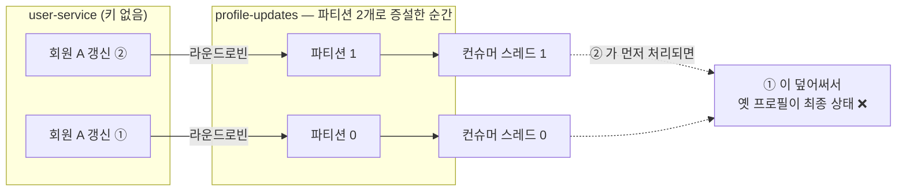
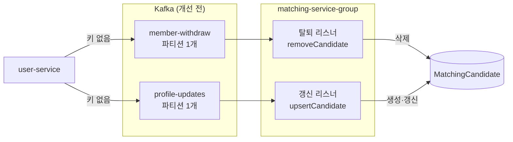
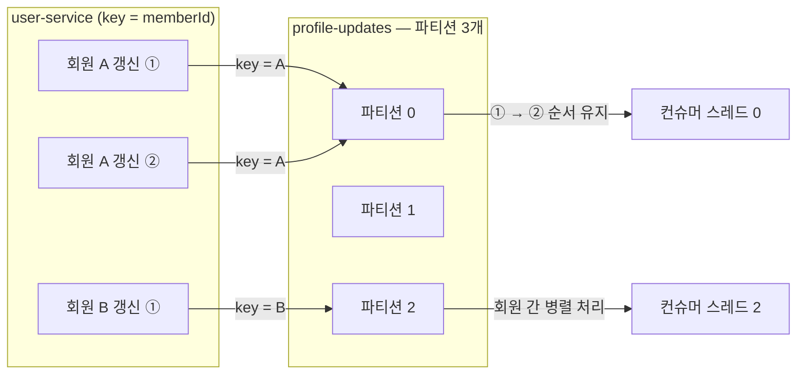
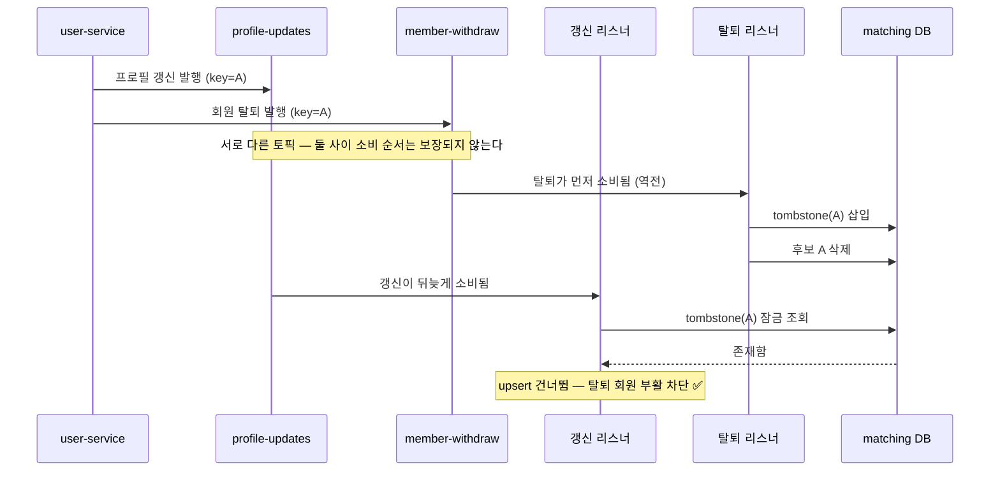

# Kafka 파티션과 메시지 키 개선

> "지금은 안 터지지만 늘리는 순간 터진다" — 파티션 증설의 선행 조건을 갖추고,
> 키로도 막을 수 없는 크로스 토픽 순서 역전까지 닫은 작업의 기록.

## 문제

모든 토픽이 브로커 auto-create 로 만들어져 **파티션 1개**였고, 프로듀서는
**메시지 키 없이** 발행하고 있었다.

```java
kafkaTemplate.send(TOPIC, event);   // key 없음 → 라운드로빈 분배
```

여기서 두 가지가 파생된다.

1. **컨슈머 병렬성이 1로 고정** — 파티션 1개면 컨슈머 그룹당 컨슈머 1개만
   배정된다. concurrency 를 올려도, 인스턴스를 늘려도 나머지는 유휴다.
   처리량 상한이 파티션 수에 묶여 있었다.
2. **파티션을 늘리는 순간 순서가 깨진다** — Kafka 의 순서 보장 단위는 토픽이
   아니라 파티션이다. 키가 없으면 같은 회원의 이벤트가 서로 다른 파티션으로
   흩어져 처리 순서가 뒤집힐 수 있다.

키 없이 파티션만 늘리면 같은 회원의 이벤트가 라운드로빈으로 흩어지고,
파티션이 다르면 처리 순서도 제각각이 된다.



가장 위험한 조합이 `member-withdraw` 와 `profile-updates` 다. 두 토픽 모두
같은 `matching-service-group` 이 소비하고 **같은 `MatchingCandidate` 레코드를
건드린다.**



```text
정상 순서   profile-updates(갱신) → member-withdraw(탈퇴)
            upsertCandidate()    → removeCandidate()      결과: 후보 삭제됨  ✅

역전 발생   member-withdraw(탈퇴) → profile-updates(갱신)
            removeCandidate()    → upsertCandidate()      결과: 탈퇴 회원이 후보로 부활  ❌
```

유실에 강하라고 만든 upsert 가 순서 역전에는 정확히 반대로 작용한다 —
지워진 뒤 도착한 갱신 이벤트가 후보를 다시 만들어 낸다.

## 바꾼 것

### 1. 프로듀서에 메시지 키(memberId) 부여 — 증설의 선행 조건

`UserEventPublisher` 의 세 토픽(`member-signup` · `member-withdraw` ·
`profile-updates`) 전부 `memberId` 를 키로 발행한다.

```java
stringKafkaTemplate.send(topic, String.valueOf(memberId), message);
```

같은 키는 같은 파티션으로 가므로 **회원 단위 순서는 파티션 수와 무관하게
보장되고, 서로 다른 회원끼리는 병렬 처리**된다.



### 2. 토픽 스펙을 코드로 명시 — `KafkaTopicConfig`

`MatchingCandidate` 를 건드리는 두 토픽을 matching-service 에서 `NewTopic`
빈으로 선언했다(파티션 3, 복제 1). 파티션 수는 "얼마나 병렬로 소비해야
하는가"에서 나오고, 그 요구를 아는 쪽은 소비자다.

- `KafkaAdmin` 은 기동 시 기존 토픽의 파티션이 선언보다 적으면 늘려 주고
  줄이지는 못하므로 멱등하게 적용된다.
- 운영 환경(`auto.create.topics.enable=false`)에서 토픽이 없어 발행·구독이
  실패하는 문제도 함께 사라진다.
- 브로커 없는 테스트 환경은 `matching.kafka.topics.enabled=false` 로 토픽
  관리를 끈다(KafkaAdmin 이 기동 시 접속을 시도하며 타임아웃까지 기다리는
  것을 막는다).

### 3. 컨슈머 병렬성 — 설정값 (`matching.kafka.candidate-listener-concurrency`)

두 `@KafkaListener` 의 concurrency 는 설정값이다(기본 3). 처음에는 파티션
수와 같은 상수로 묶었지만, 두 숫자의 성격이 달라서 풀었다. 파티션 수는
늘릴 수만 있는 비가역 결정이라 코드에 박는 게 맞고, concurrency 는 재기동으로
바꿀 수 있는 데다 적정값이 실제 트래픽·인스턴스 수를 본 뒤에야 정해지므로
그 판단을 코드 상수로 미리 닫아 둘 이유가 없다.

조정 범위: 파티션 수(3)를 넘는 값은 유휴 스레드만 만들므로 상한은 3.
줄이는 것은 자유다 — 회원 단위 순서는 "같은 키 = 같은 파티션"이라는
프로듀서 쪽 속성으로 보장되므로 소비 스레드 수를 줄여도 깨지지 않는다.

### 4. 탈퇴 tombstone — 키로는 못 막는 역전을 닫는다

**키의 순서 보장 범위는 한 토픽의 한 파티션이다.** 탈퇴와 갱신은 서로 다른
토픽이므로 키를 걸어도 둘 사이의 순서는 보장되지 않는다(파티션이 1개였던
기존 구조에서도 마찬가지로 존재하던 창이다). 탈퇴가 먼저 처리되고 갱신이
늦게 도착하면 upsert 가 후보를 되살린다.

그래서 삭제를 "레코드 없음"이 아니라 **`WithdrawnMember` 레코드의 존재**로
남긴다.

- `removeCandidate` — tombstone 을 `saveAndFlush` 로 즉시 INSERT 한 뒤 후보를
  **잠금 조회(current read)** 로 지운다. 재전달에 멱등.
- `upsertCandidate` — tombstone 을 잠금 조회하고, 있으면 갱신 이벤트를
  무시한다.



concurrency 3 에서 두 이벤트는 실제로 서로 다른 스레드에서 **동시에** 처리될
수 있고, 이 동시 실행 창은 순서만으로는 닫히지 않는다. 그래서 양쪽 모두
잠금이 필요하다.

- **upsert 쪽**: tombstone 조회가 잠금 조회(`PESSIMISTIC_WRITE`)다. 행이
  없으면 InnoDB 갭 락이 걸려서, 같은 회원의 탈퇴 트랜잭션이 tombstone 을
  넣으려면 upsert 커밋까지 기다려야 한다 — 두 트랜잭션의 직렬화 지점.
- **탈퇴 쪽**: 갭 락 대기가 풀린 뒤의 후보 삭제도 **잠금 조회(current
  read)** 여야 한다. MySQL REPEATABLE READ 에서 일반 조회는 트랜잭션 시작
  시점의 스냅샷을 읽기 때문에, 대기가 풀리는 동안 upsert 가 커밋한 후보를
  보지 못하고 삭제를 건너뛴다. 그러면 tombstone 은 남지만 후보도 남고,
  탈퇴 회원은 이벤트를 더 내지 않으므로 그 후보는 **영구히 매칭 대상으로
  잔존**한다. 잠금 조회는 스냅샷과 무관하게 최신 커밋을 읽어 이 구멍을
  막는다.

#### 토픽 retention — 축제 단발성 서비스에 7일은 과하다

`member-withdraw` · `profile-updates` 의 retention 을 브로커 기본 7일에서
**1일**로 명시했다(`KafkaTopicConfig`, `retention.ms`). 단, "몇 분" 수준까지
줄이지는 않았다. retention 은 저장 비용이 아니라 **컨슈머가 죽어 있어도
되는 최대 시간**이기 때문이다.

발행됐지만 아직 소비되지 않은 메시지는 retention 이 지나면 소비 여부와
무관하게 소거된다. retention 이 컨슈머 다운타임보다 짧으면 그 사이
발행분이 조용히 사라진다 — 재시도도 DLT 도 개입할 기회가 없는, 이번
작업이 없애려던 바로 그 조용한 유실이다.

```text
retention 이 덮어야 하는 창
  배포 다운타임                 수 분
  신규 파티션 배정 지연          최대 5분 (earliest 절 참고)
  차단 재시도 head-of-line      레코드당 최대 7초 × 백로그
  야간 크래시 → 아침 발견        수 시간   ← 하한을 결정
```

밤새 장애를 아침에 발견하는 시나리오까지 덮는 하한이 1일이다.
기존 토픽에도 적용되도록 `KafkaAdmin.setModifyTopicConfigs(true)` 를 켰다
(NewTopic 에 선언한 config 만 비교·수정하므로 다른 설정에는 무해).
`.DLT` 토픽은 사람이 열어 보고 재처리하는 곳이라 줄이지 않는다(기본 7일).

#### tombstone TTL — 영구 보존이 만드는 반대 방향의 사고

tombstone 은 늦은 갱신 이벤트가 올 수 있는 동안만 필요하다. 그 상한은
`profile-updates` 의 retention(위에서 1일로 명시)이다 — 그보다 오래된
이벤트는 토픽에서 소거되어 도착 자체가 불가능하다. 반대로 영구히 남기면
같은 memberId 로 **재가입**한 회원의 프로필 이벤트가 tombstone 에 걸러져
영원히 매칭에서 제외된다.

그래서 `WithdrawnMemberCleanupScheduler` 가 매일 04시에 `withdrawnAt` 이
보존 기간(기본 2일 = retention 의 2배, `matching.tombstone.retention-days`)
을 넘긴 행을 벌크 삭제한다. 다중 인스턴스에서 겹쳐 돌아도 멱등이라 분산
락은 두지 않았다.

**운영 제약**: `profile-updates.DLT` 재적재(re-drive)는 반드시 이 보존
기간(2일) 안에 해야 한다. TTL 이후 재적재하면 tombstone 이 이미 지워져
탈퇴 회원이 부활할 수 있다. retention 을 늘리면 `retention-days` 도 같이
늘려야 한다.

### 5. `auto.offset.reset=earliest` — 증설이 유실이 되지 않게

공통 컨슈머 팩토리는 yml 의 `spring.kafka.consumer.*` 를 읽지 않는 수동
구성이라, yml 에 뭐라고 적어도 실제로는 클라이언트 기본값 **latest** 가
적용되고 있었다. latest 는 파티션 증설과 만나는 순간 유실이 된다.

```text
증설 직후 새 파티션(p1, p2)에는 어떤 그룹의 커밋 오프셋도 없다
   → 프로듀서는 메타데이터 갱신 즉시 새 파티션으로 발행 시작
   → 컨슈머 그룹은 메타데이터 갱신(최대 5분) 후에야 새 파티션을 배정받음
   → latest: 배정 시점에 로그 끝으로 점프 → 그 사이 발행분 영구 유실
```

`member-withdraw` 는 notification 도 구독하므로 탈퇴 메일이 소리 없이
누락되고, matching 쪽은 tombstone 미기록·후보 미삭제로 이어진다. 팩토리에
`earliest` 를 명시했다 — 커밋 오프셋이 있는 기존 파티션에는 아무 영향이
없고, 오프셋이 없는 새 파티션만 처음부터 읽는다.

## 전환 절차 — 증설은 배포 순서가 반이다

키 지정(프로듀서, user-service)과 파티션 증설(`KafkaAdmin`, matching-service)
은 서로 다른 서비스에서 일어난다. 순서가 뒤집히면 키 없는 프로듀서가 3개
파티션에 이벤트를 뿌리는 구간이 생긴다.

```text
① user-service 배포        키 지정. 파티션이 아직 1개라 동작 변화 없음(무해)
② 컨슈머 lag 드레인 확인    p0 에 쌓인 백로그를 소진
③ matching-service 배포     KafkaAdmin 이 파티션 1 → 3 증설
```

이 순서대로 해도 전환 구간에는 한계가 남는다. 기존 백로그는 전부 p0 에
있고 새 메시지는 p1·p2 로 흩어지는데, 파티션별 소비 속도가 다르므로 **같은
회원의 옛 이벤트(p0)가 새 이벤트(p2)보다 늦게 처리될 수 있다.**
`upsertCandidate` 에는 버전·타임스탬프 비교가 없어 늦게 온 옛 프로필이 새
프로필을 덮어쓴다(다음 갱신 때 자연 복구). ② 로 창을 최소화하는 것이 현재의
대응이고, 이벤트에 버전을 실어 stale 갱신을 거부하는 것이 다음 단계다.

## 재시도와 DLT — 유실을 눈에 보이게

순서를 지켜도 **이벤트가 사라지면 소용이 없다.** tombstone은 역전을 막을 뿐
유실은 못 막는다. 실패했을 때의 결과가 컨슈머마다 달랐던 것부터 정리했다.

```text
개선 전
  탈퇴 컨슈머      catch (Exception e) { log.error(...) }   ← 1회 실패 = 즉시 유실
  채팅방 컨슈머    catch (Exception e) { throw e; }         ← 간격 0으로 10번 → 포기
  나머지           예외 전파                                 ← 위와 동일
```

예외를 삼키면 오프셋이 그대로 커밋되어 **재시도도 DLT도 없이** 탈퇴가 사라지고,
후보 테이블에 탈퇴 회원이 영구히 남는다. 그래서 삼킴을 먼저 걷어냈다 —
이걸 두면 에러 핸들러가 예외를 볼 기회가 없어 DLT를 붙여도 무용지물이다.

### 왜 차단(blocking) 재시도인가

`@RetryableTopic`(비차단)은 실패한 레코드를 별도 재시도 토픽으로 보내고 원래
파티션은 곧바로 다음 레코드를 처리한다. **그러면 앞의 모든 작업이 무너진다.**

```text
비차단 재시도
  갱신① 처리 실패 → 재시도 토픽으로 이동
  갱신② 즉시 처리 → 최신 프로필 반영
  5초 뒤 갱신① 재시도 성공 → 갱신②를 덮어씀
  결과: 메시지 키로 만든 파티션 내 순서 보장이 재시도 경로에서만 깨짐 ❌
```

차단 방식은 그 자리에서 멈추고 다시 시도하므로 순서가 유지된다. 대가는 재시도
동안 그 파티션이 멈추는 것(head-of-line blocking)이라, **총합을 7초**
(1초 → 2초 → 4초, 최초 1회 + 재시도 3회)로 묶었다.
재시도 총합이 `max.poll.interval.ms`(기본 5분)를 넘으면 브로커가 컨슈머를 죽은
것으로 보고 리밸런스를 일으켜 문제가 더 커지기 때문이다.

### 무엇을 재시도에서 빼는가

역직렬화·타입 변환 실패는 재시도 대상이 아니다(`DefaultErrorHandler` 기본값).
같은 바이트를 다시 읽어도 결과가 같으므로 7초를 낭비할 이유가 없다.

반면 **업무 예외는 일부러 재시도 대상으로 남겼다.** Feign 호출 실패 같은
일시적 원인이 `BusinessException`으로 감싸여 올라오는 경로가 있어서, 재시도
제외로 분류하면 회복할 수 있는 실패까지 DLT로 보내게 된다. 잘못 분류했을 때의
손해가 7초 지연보다 크다.

### 함께 닫은 구멍 두 개

- **poison pill** — `JsonDeserializer`를 그대로 쓰면 역직렬화 실패가 poll
  단계에서 터진다. 그 단계에는 에러 핸들러가 개입할 수 없어 오프셋이 넘어가지
  못하고 **같은 레코드를 무한히 다시 읽는다.** 깨진 메시지 하나가 파티션을
  영구히 막는 것이다. `ErrorHandlingDeserializer`로 감싸 리스너 단계의 예외로
  바꿨다.
- **DLT 파티션 불일치** — `DeadLetterPublishingRecoverer`는 기본적으로 원본과
  같은 파티션 번호로 보낸다. 원본이 3파티션인데 DLT가 1파티션이면 "2번
  파티션으로 보내라"가 실패해서, **유실을 막으려고 만든 장치가 유실 지점이
  된다.** 파티션을 -1로 넘겨 프로듀서가 키로 고르게 했다.

DLT 토픽 스펙도 코드에 박았다(`comatching.kafka.dlt-topics`). 운영 환경은
auto-create가 꺼져 있어 DLT 토픽이 없으면 옮길 곳 자체가 없기 때문이다.

### DLT 적재 알림 — 쌓인 걸 이틀 안에 알아채야 한다

DLT 는 사람이 열어 보고 고치는 저장소인데, 적재 사실을 사람이 모르면
유실을 눈에 보이게 만든 의미가 없다. 특히 `profile-updates.DLT` 재적재는
tombstone TTL(2일) 안에 해야 하므로 알아채는 데에 기한이 있다.

`DeadLetterPublishingRecoverer` 를 감싸 **DLT 발행이 성공한 직후** 웹훅으로
알린다(`KafkaDltAlertNotifier`, `comatching.kafka.dlt-alert-webhook-url`).
본문에 `{"content", "text"}` 두 키를 같이 실어 Discord·Slack 어느 웹훅
URL 을 줘도 동작한다. 설계 결정들:

- **Prometheus + Alertmanager 가 아닌 이유** — 현재 모니터링 스택은 부하
  테스트 때만 띄우는 구성이라 상시 알림의 기반이 못 되고, 알림 하나를 위해
  Alertmanager·kafka-exporter 를 상시 운영에 추가하는 것은 단발성 서비스에
  과하다. 발행 시점 알림은 어느 메시지가 왜 실패했는지까지 본문에 실린다.
- **토픽별 쿨다운(기본 5분)** — poison pill 뒤 백로그가 연쇄로 DLT 에
  떨어지면 웹훅이 도배되고, rate limit 에 걸리면 정작 다른 토픽의 알림까지
  막힌다. 억제된 건수는 다음 알림에 합산 보고한다.
- **전송 실패는 삼킨다** — 알림 장애가 소비 흐름(오프셋 진행)을 막으면
  주객전도다. 웹훅과 무관하게 적재는 항상 `log.error` 로 남는다.
- **발행 성공 후에만 알린다** — DLT 발행 자체가 실패하면 recoverer 예외가
  에러 핸들러로 전파되어 다시 다뤄지므로, 그 시점 알림은 이르다.

## 검증

| 테스트 | 방식 | 결과 |
|---|---|---|
| 같은 회원의 이벤트가 memberId 키로 같은 파티션에 발행 순서대로 쌓인다 | EmbeddedKafka, 3파티션 토픽에 실제 발행 후 키·파티션·오프셋 확인 (`UserEventPublisherIT`) | ✅ |
| 정상 순서: 갱신 → 탈퇴 ⇒ 후보 삭제 + tombstone | 실제 MySQL (Testcontainers, `CandidateServiceImplIT`) | ✅ |
| 역전 순서: 탈퇴 → 늦은 갱신 ⇒ 후보 부활하지 않음 | 〃 | ✅ |
| 탈퇴 이벤트 재전달·후보 없는 탈퇴 ⇒ 멱등 | 〃 | ✅ |
| 탈퇴하지 않은 회원의 upsert 는 그대로 동작 (신규 + 갱신) | 〃 | ✅ |
| **동시 실행**: upsert 가 갭 락을 잡고 진행 중일 때 탈퇴가 끼어들어도 후보가 남지 않음 | 실제 MySQL, 두 스레드·두 트랜잭션으로 교차 재현 | ✅ |
| TTL 경과 tombstone 만 삭제되고 보존 기간 내 행은 남는다 | 실제 MySQL (`WithdrawnMemberCleanupSchedulerIT`) | ✅ |
| 계속 실패하는 메시지가 재시도 4회(최초 1 + 3) 후 `.DLT` 로 옮겨지고, 원본 키·위치 헤더가 보존됨 | EmbeddedKafka, 실제 실패 리스너 (`KafkaRetryAndDltIT`) | ✅ |
| 일시적 실패는 재시도로 회복되고 DLT 로 가지 않음 | 〃 | ✅ |
| DLT 이동 시에만 알림 발화, 회복된 실패는 알리지 않음 | 〃 | ✅ |
| 쿨다운 억제·억제 건수 합산 보고·토픽별 독립·미설정 시 no-op | 시계 주입 단위 테스트 (`KafkaDltAlertNotifierTest`) | ✅ |

user-service · matching-service 전체 테스트 회귀 통과 (failures 0, errors 0).
구현 후 별도의 다각도 검증(Kafka 의미론·JPA 잠금·운영 설정)을 거쳐 발견된
스냅샷 읽기 구멍(동시 실행 시 후보 미삭제)과 latest 유실 창을 반영했다.

## 남은 한계 (다음 순서)

1. **DLT 에 쌓인 메시지를 되돌리는 경로가 없다** — 적재 알람은 붙였지만,
   원인을 고친 뒤 재처리하는 것은 아직 수동(콘솔 재발행)이다. 재적재 기한이
   tombstone TTL(2일)로 묶여 있으므로 재처리 수단이 다음 단계다.
2. **메일 발송은 재시도가 중복 발송이 될 수 있다** — 후보 삭제·갱신은 멱등이라
   재시도가 안전하지만, notification 의 메일은 SMTP 타임아웃처럼 "보냈는지
   모르는" 실패에서 같은 메일이 두 번 갈 수 있다. 누락보다 중복이 낫다고
   보고 재시도를 유지했다. 발송 원장을 두는 것이 정공법이다.
3. **컨슈머 설정이 커스텀 팩토리에 가려 yml 이 적용되지 않는 문제**는 이번
   범위 밖. `auto.offset.reset` 만 유실 위험 때문에 코드에 명시했고, 나머지는
   `KafkaProperties` 기반 정정이 다음 단계다.
4. **갱신 이벤트에 버전·타임스탬프가 없다** — 같은 토픽 안에서는 키가 순서를
   보장하지만, 전환 구간·재처리처럼 순서가 흔들리는 상황에서 stale 갱신을
   거부할 수단이 없다.
5. **복제 계수 1** — 브로커가 1대라서다. 브로커 증설 시
   `KafkaTopicConfig.REPLICATION_FACTOR` 만 올리면 된다.
6. `chat-notification` 은 `roomId` 키가 자연스럽다 — chat 쪽 발행부를 만질 때
   같은 방식으로.
