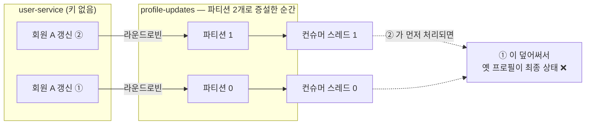
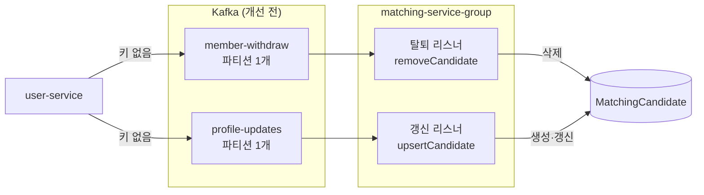
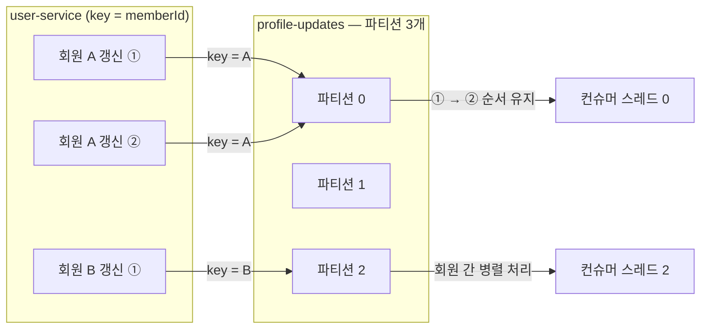
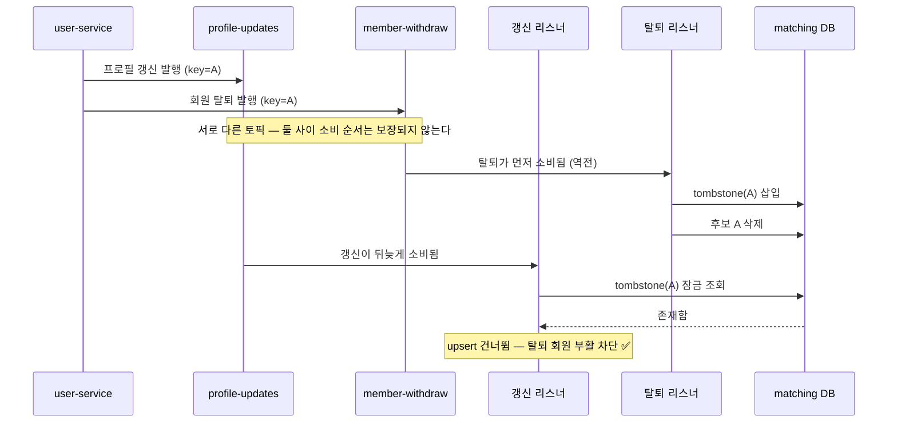

# Kafka 파티션과 메시지 키 개선

> "지금은 안 터지지만 늘리는 순간 터진다" — 파티션 증설의 선행 조건을 갖추고,
> 키로도 막을 수 없는 크로스 토픽 순서 역전까지 닫은 작업의 기록.

## 문제

모든 토픽이 브로커 auto-create 로 만들어져 **파티션 1개**였고, 프로듀서는
**메시지 키 없이** 발행하고 있었다.

```java
kafkaTemplate.send(TOPIC, event);   // key 없음 → 라운드로빈 분배
```

여기서 두 가지가 파생된다.

1. **컨슈머 병렬성이 1로 고정** — 파티션 1개면 컨슈머 그룹당 컨슈머 1개만
   배정된다. concurrency 를 올려도, 인스턴스를 늘려도 나머지는 유휴다.
   처리량 상한이 파티션 수에 묶여 있었다.
2. **파티션을 늘리는 순간 순서가 깨진다** — Kafka 의 순서 보장 단위는 토픽이
   아니라 파티션이다. 키가 없으면 같은 회원의 이벤트가 서로 다른 파티션으로
   흩어져 처리 순서가 뒤집힐 수 있다.

키 없이 파티션만 늘리면 같은 회원의 이벤트가 라운드로빈으로 흩어지고,
파티션이 다르면 처리 순서도 제각각이 된다.



가장 위험한 조합이 `member-withdraw` 와 `profile-updates` 다. 두 토픽 모두
같은 `matching-service-group` 이 소비하고 **같은 `MatchingCandidate` 레코드를
건드린다.**



```text
정상 순서   profile-updates(갱신) → member-withdraw(탈퇴)
            upsertCandidate()    → removeCandidate()      결과: 후보 삭제됨  ✅

역전 발생   member-withdraw(탈퇴) → profile-updates(갱신)
            removeCandidate()    → upsertCandidate()      결과: 탈퇴 회원이 후보로 부활  ❌
```

유실에 강하라고 만든 upsert 가 순서 역전에는 정확히 반대로 작용한다 —
지워진 뒤 도착한 갱신 이벤트가 후보를 다시 만들어 낸다.

## 바꾼 것

### 1. 프로듀서에 메시지 키(memberId) 부여 — 증설의 선행 조건

`UserEventPublisher` 의 네 토픽(`member-signup` · `member-update` ·
`member-withdraw` · `profile-updates`) 전부 `memberId` 를 키로 발행한다.

```java
stringKafkaTemplate.send(topic, String.valueOf(memberId), message);
```

같은 키는 같은 파티션으로 가므로 **회원 단위 순서는 파티션 수와 무관하게
보장되고, 서로 다른 회원끼리는 병렬 처리**된다.



### 2. 토픽 스펙을 코드로 명시 — `KafkaTopicConfig`

`MatchingCandidate` 를 건드리는 두 토픽을 matching-service 에서 `NewTopic`
빈으로 선언했다(파티션 3, 복제 1). 파티션 수는 "얼마나 병렬로 소비해야
하는가"에서 나오고, 그 요구를 아는 쪽은 소비자다.

- `KafkaAdmin` 은 기동 시 기존 토픽의 파티션이 선언보다 적으면 늘려 주고
  줄이지는 못하므로 멱등하게 적용된다.
- 운영 환경(`auto.create.topics.enable=false`)에서 토픽이 없어 발행·구독이
  실패하는 문제도 함께 사라진다.
- 브로커 없는 테스트 환경은 `matching.kafka.topics.enabled=false` 로 토픽
  관리를 끈다(KafkaAdmin 이 기동 시 접속을 시도하며 타임아웃까지 기다리는
  것을 막는다).

### 3. 컨슈머 병렬성 활용 — `concurrency = 3`

두 `@KafkaListener` 의 concurrency 를 파티션 수와 같은 상수
(`KafkaTopicConfig.CANDIDATE_LISTENER_CONCURRENCY`)로 묶었다. 파티션 수보다
큰 값은 유휴 스레드만 만들기 때문에 두 숫자는 한 곳에서 관리한다.

### 4. 탈퇴 tombstone — 키로는 못 막는 역전을 닫는다

**키의 순서 보장 범위는 한 토픽의 한 파티션이다.** 탈퇴와 갱신은 서로 다른
토픽이므로 키를 걸어도 둘 사이의 순서는 보장되지 않는다(파티션이 1개였던
기존 구조에서도 마찬가지로 존재하던 창이다). 탈퇴가 먼저 처리되고 갱신이
늦게 도착하면 upsert 가 후보를 되살린다.

그래서 삭제를 "레코드 없음"이 아니라 **`WithdrawnMember` 레코드의 존재**로
남긴다.

- `removeCandidate` — tombstone 삽입 → 후보 삭제 (이 순서여야 "후보는
  지워졌는데 tombstone 은 아직"인 중간 상태가 없다). 재전달에 멱등.
- `upsertCandidate` — tombstone 이 있으면 갱신 이벤트를 무시한다.



tombstone 조회는 잠금 조회(`PESSIMISTIC_WRITE`)다. 행이 없으면 InnoDB 갭
락이 걸려서, "upsert 가 tombstone 없음을 확인 → 탈퇴가 커밋 → upsert 가 후보
삽입 커밋" 으로 부활하는 좁은 동시성 창까지 닫는다. concurrency 3 에서 두
이벤트는 실제로 서로 다른 스레드에서 동시에 처리될 수 있다.

## 검증

| 테스트 | 방식 | 결과 |
|---|---|---|
| 같은 회원의 이벤트가 memberId 키로 같은 파티션에 발행 순서대로 쌓인다 | EmbeddedKafka, 3파티션 토픽에 실제 발행 후 키·파티션·오프셋 확인 (`UserEventPublisherIT`) | ✅ |
| 정상 순서: 갱신 → 탈퇴 ⇒ 후보 삭제 + tombstone | 실제 MySQL (Testcontainers, `CandidateServiceImplIT`) | ✅ |
| 역전 순서: 탈퇴 → 늦은 갱신 ⇒ 후보 부활하지 않음 | 〃 | ✅ |
| 탈퇴 이벤트 재전달·후보 없는 탈퇴 ⇒ 멱등 | 〃 | ✅ |
| 탈퇴하지 않은 회원의 upsert 는 그대로 동작 (신규 + 갱신) | 〃 | ✅ |

user-service · matching-service 전체 테스트 회귀 통과 (failures 0, errors 0).

## 남은 한계 (다음 순서)

1. **DLT · 재시도 정책 없음** — 탈퇴 이벤트가 소비 실패로 유실되면 후보가
   잔존한다. tombstone 은 순서 역전을 막을 뿐 유실을 막지는 못한다.
2. **컨슈머 설정이 커스텀 팩토리에 가려 yml 이 적용되지 않는 문제**는 이번
   범위 밖 (auto-offset-reset 등).
3. **복제 계수 1** — 브로커가 1대라서다. 브로커 증설 시
   `KafkaTopicConfig.REPLICATION_FACTOR` 만 올리면 된다.
4. `chat-notification` 은 `roomId` 키가 자연스럽다 — chat 쪽 발행부를 만질 때
   같은 방식으로.
